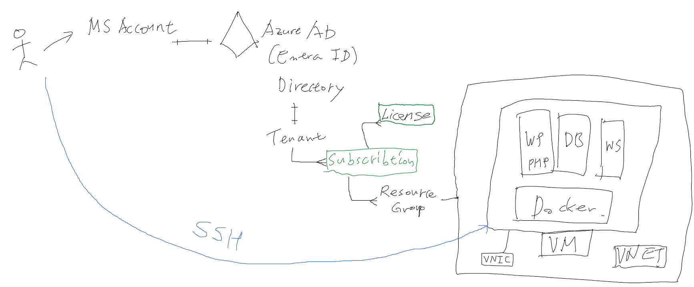
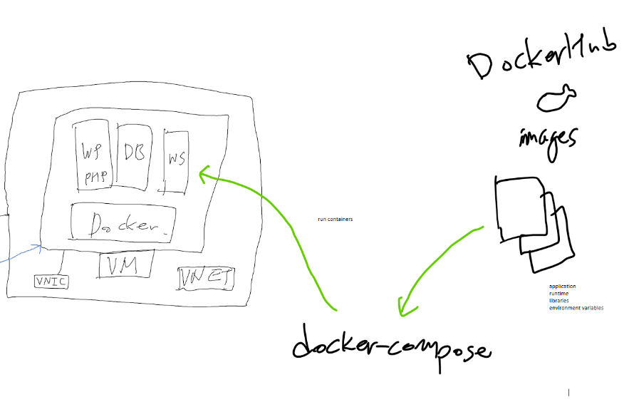

**Using Docker to run WordPress on an Azure VM**

# Part 1 - Azure MV



Goto portal.azure.com
- Create a Microsoft account - probably personal account
- Log in into the account

Create Subscription
- free credits for one year for practice

Create a VM
- Name - any name
- Region
    - Australia East
- Image
    - Ubuntu 22.04 LTS
- Username
    - default: "azureuser"
- Create SSH private/public key
    - store private locally
    - store public key inside the VM
- Inbound ports
    - for SSH: 22
    - for HTTP: 80

SSH connection using Putty
- SSH key format conversion
    - using PuttyGen
    - Putty > Conversions
    - convert PEM to PPK
- Connect to the VM
    - get the public IP from the Azure VM page
    - Host name: azureuser@&lt;ip address>
- Run command for Ubuntu update
    ``` sh
    sudo apt update && sudo apt upgrade -y
    ```

# Part 2 - Docker


⚠️ Everything below should be done inside the VM

Connect to the public GitHub repository 
- https://github.com/tommy-yoon/azure-vm-docker-wordpress
- clone all the files
    ```
    sudo git clone https://github.com/tommy-yoon/azure-vm-docker-wordpress.git
    ```
- If requied change owner
    ``` sh
    sudo chown -R $USER:$USER azure-vm-docker-wordpress/
    ```
- Fetch files from GitHub
    ``` sh
    cd azure-vm-docker-wordpress

    sudo git pull
    ```

Install Docker engine & docker-compose
1. Remove existing Docker packages. 
    ``` sh
    sudo apt-get remove docker docker-engine docker.io containerd runc 
    ```
2. Update the apt package index. 
    ``` ah
    sudo apt-get update 
    sudo apt-get install ca-certificates curl gnupg 
    ```
3. Add the Docker GPG kye. 
    ``` sh
    sudo install -m 0755 -d /etc/apt/keyrings 
    curl -fsSL https://download.docker.com/linux/ubuntu/gpg | sudo gpg --dearmor -o /etc/apt/keyrings/docker.gpg 
    sudo chmod a+r /etc/apt/keyrings/docker.gpg 
    ```
4. Set-up the repository. 
    ``` sh
    echo "deb [arch="$(dpkg --print-architecture)" signed-by=/etc/apt/keyrings/docker.gpg] https://download.docker.com/linux/ubuntu "$(. /etc/os-release && echo "$VERSION_CODENAME")" stable" | sudo tee /etc/apt/sources.list.d/docker.list > /dev/null 
    ```
5. Install Docker from the official repo. 
    ``` sh
    sudo apt-get update  
    sudo apt-get install docker-ce docker-ce-cli containerd.io docker-buildx-plugin docker-compose-plugin 
    ```
6. Install docker-compose 
    ``` sh
    sudo apt install docker-compose 
    ```
7. Verify its installation
    ``` sh
    docker --version
    docker-compose --version
    ```

Create Dockerfile 
- actually docker-compose for multiple docker containers
- YAML format
- Use docker-compose.yml

Running docker-compose
- Download Docker images
- Build and run Docker containers
    ``` sh
    sudo docker-compose up -d 
    ```
Verify its running
- 3 Docker images are downloaded
    ``` sh
    sudo docker image ls
    ```
- 3 containers should be running
    ``` sh
    sudo docker-compose ps
    ```

Access WordPress web page
- http://&lt;IP address of VM>/
- It will show the initialisation page of WordPress
- Use Wordpress to post articles after the initialisation
- Change the them to Twenty Twenty-Two

Backup DB and images
- You can backup/restored blog contents
    - Refer to [backup_db.sh](./backup_db.sh) and [backup_db.sh](./backup_db.sh)
- You can backup/restored uploaded images to blogs
    - Refer to [backup_images.sh](./backup_images.sh) and [restore_images.sh](./restore_images.sh)

If required, change mod
``` sh
chmod 755 *.sh
```

Shutdown docker-compose
``` sh
sudo docker-compose down
```

Find and remove Docker volume
``` sh
sudo docker volume ls

sudo docker rm <volumen name>
```

⚠️ Don't forget shutting down the Azure VM to avoid charging